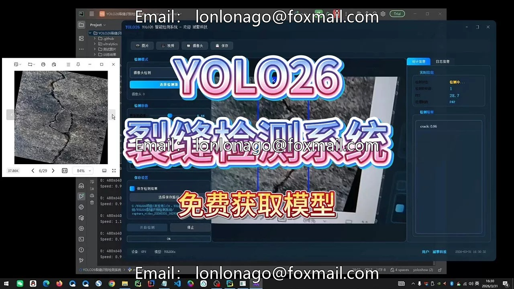
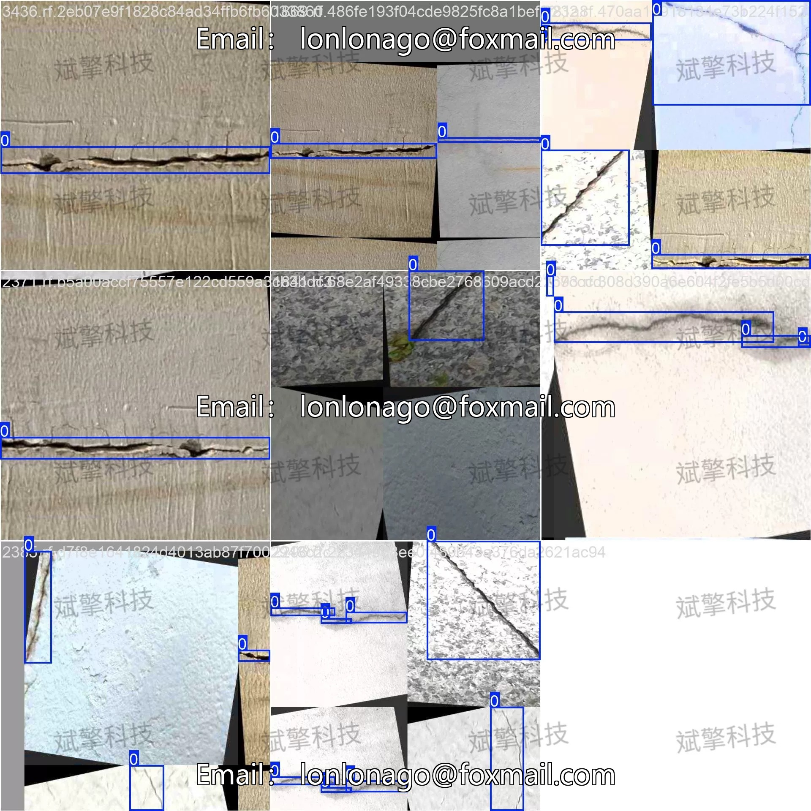
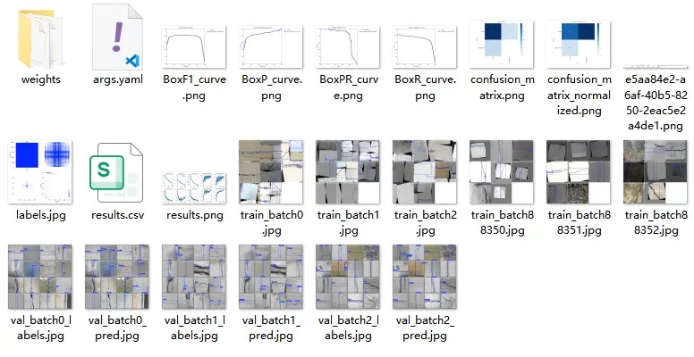
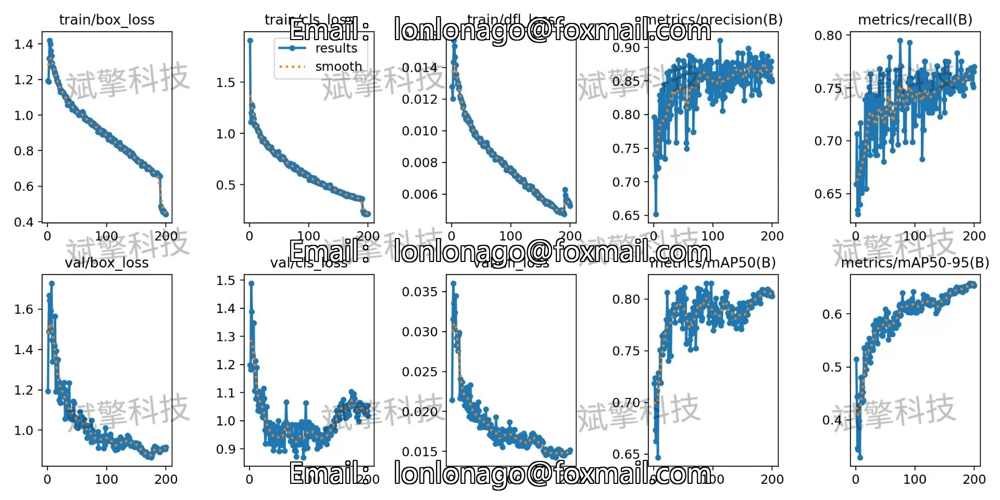
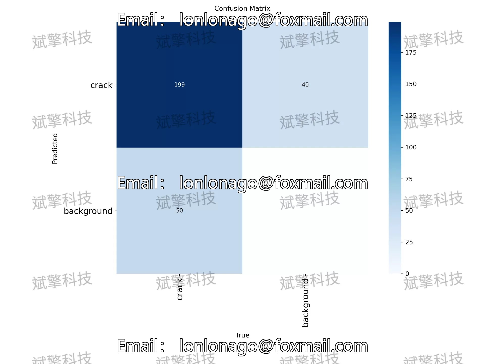
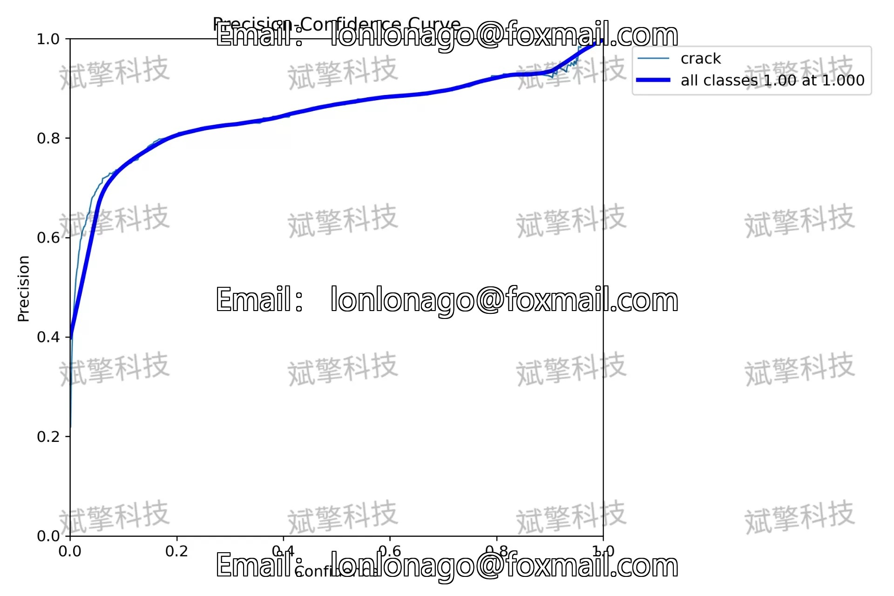
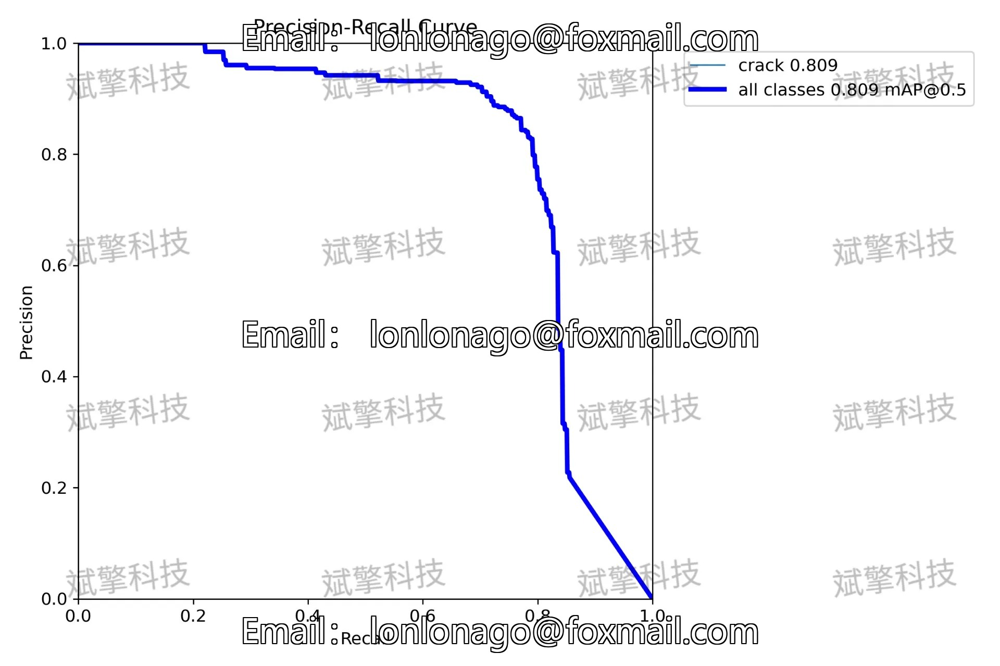
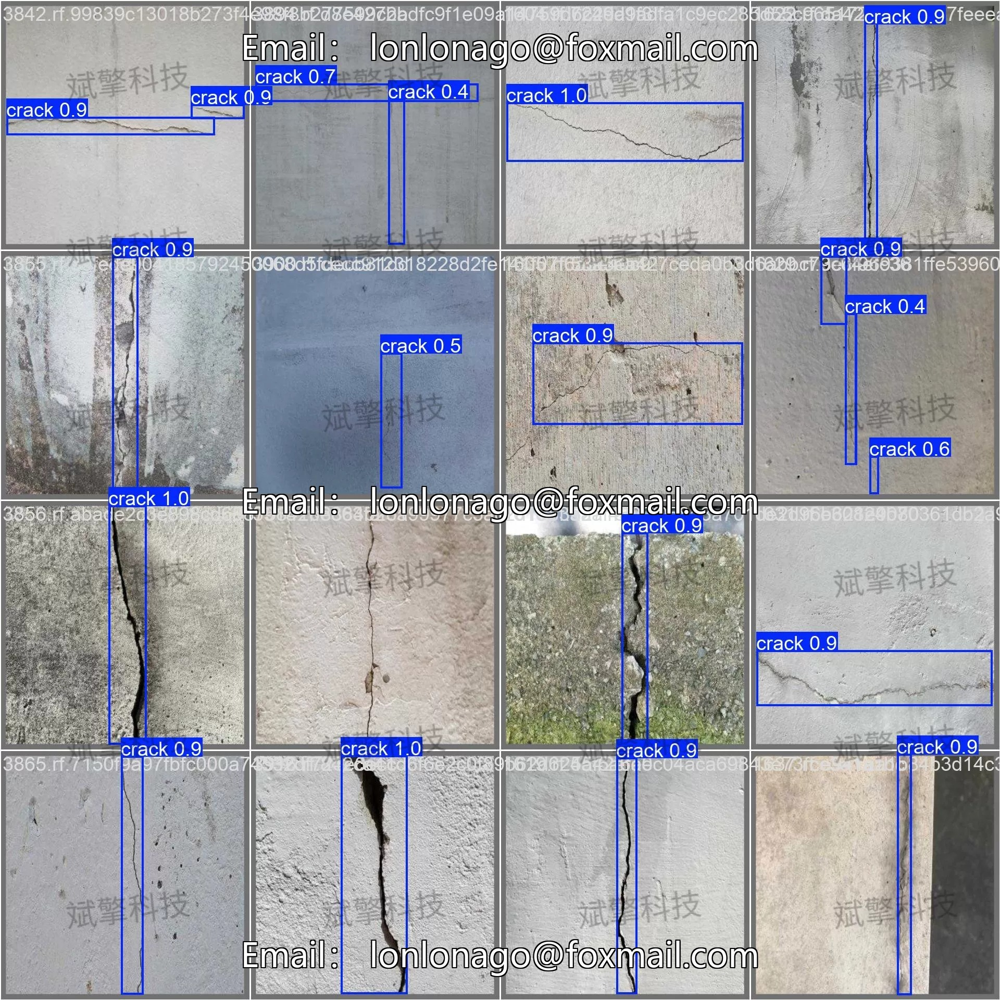
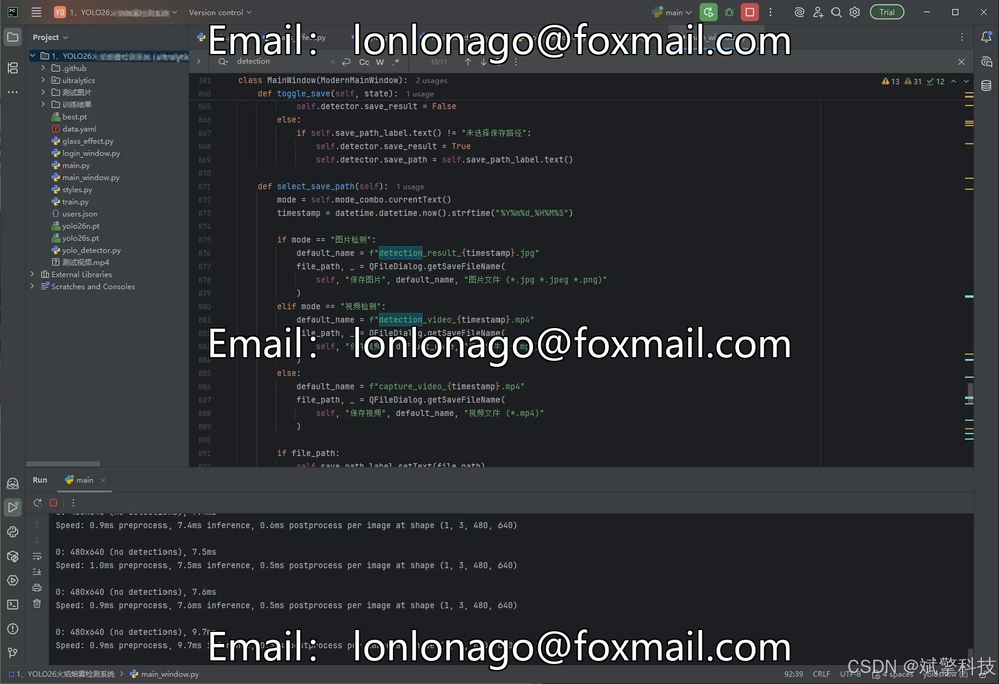

# YOLOv26 Crack Detection System | Dataset

## Body

YOLO26 Cracks Detection System | Data from 3717 Cracks Images to mAP 0.809: A Step-by-Step Guide to Train a High Precision Cracks Detection Model with YOLO26

This study is based on the YOLO26 object detection framework and has built an intelligent recognition system for structural cracks. The system uses a single-class detection (“crack”), with a training set of 3717 images, a validation set of 200 images, and a test set of 112 images. The experimental results show that the model achieves a mailto:mAP@0.5 0.809, F1 peak 0.81 (confidence 0.48), recall rate 0.84, precision 0.864, demonstrating excellent detection performance. The confusion matrix shows that the crack recognition accuracy reaches 80%, with a background false alarm rate of 20%. The training process is stable, with the loss function continuously decreasing and the validation indicator steadily increasing, indicating that the model converges well and has strong generalization capabilities. This system can provide an efficient, automated crack detection solution for infrastructure health monitoring.

The study used its own crack image dataset, consisting of 4029 images, divided into:
Training set: 3717 images
Validation set: 200 images
Test set: 112 images
The dataset is labeled as a single category: “crack” (cracks), all images are manually labeled in the YOLO standard format (normalized bounding box).

Free reservation for remote installation. Unsuccessful full refund.
Purchase includes the following resources (auto-unlocked in Baidu Cloud):
YOLO Identification Detection Project complete source code
YOLO format datasets
Training code + UI interface code
Trained model + result images
Software installation package
Add WeChat for remote installation (automatically displayed WeChat ID after purchase) - Full refund if unsuccessful

⚙️ Core Function Modules
Detection Capability
    Image detection: upload and detect, return detection boxes + category information
    Video detection: supports video files, analyzes frames accurately
    Camera real-time detection: connects USB camera, realizes dynamic monitoring
Interaction and Control
    Target selection: freely choose one or more categories for detection
    Parameter adjustment: adjustable confidence threshold & IoU threshold, flexibly control accuracy
    Result saving: save images/video/camera detection results in one click
System and Data
    User login registration: supports password strength detection + encryption storage
    Log recording: automatically records operation and error information (timestamped)

## Images

## Payment

Here is a pay link on Stripe ( https://buy.stripe.com/3cs8yP7sY87d0vu9AB ). Please contact me lonlonago@foxmail.com after funding $89, and I will send you a complete data files , thank you!

